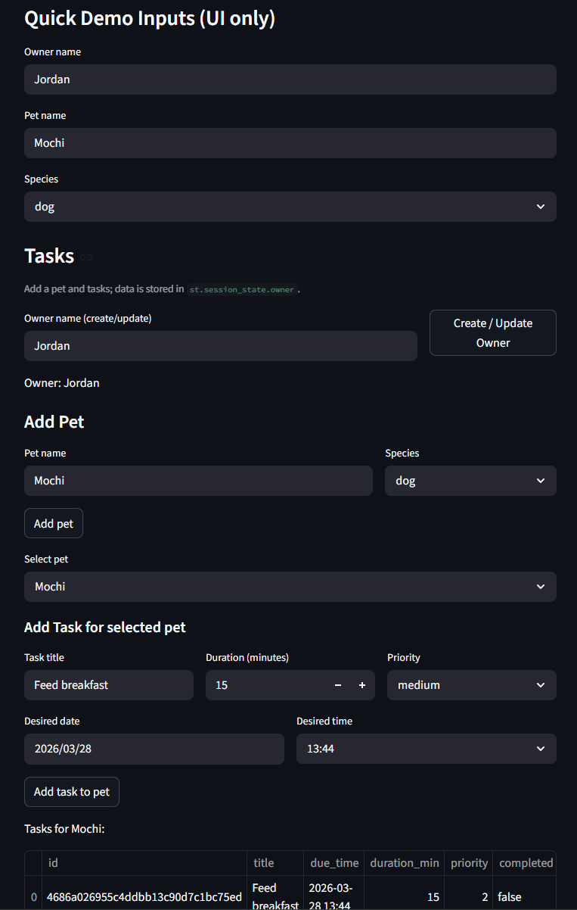
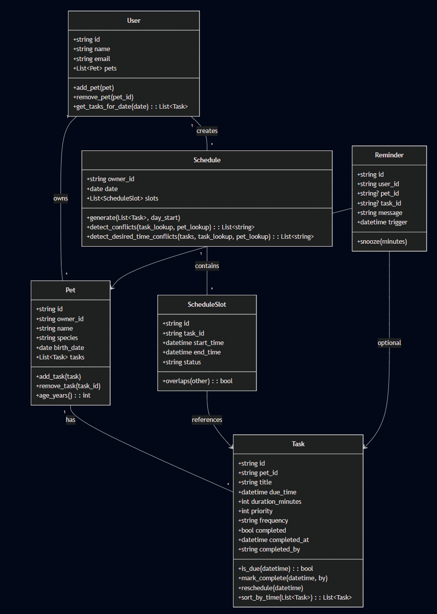

# PawPal+ (Module 2 Project)

You are building **PawPal+**, a Streamlit app that helps a pet owner plan care tasks for their pet.

## Scenario

A busy pet owner needs help staying consistent with pet care. They want an assistant that can:

- Track pet care tasks (walks, feeding, meds, enrichment, grooming, etc.)
- Consider constraints (time available, priority, owner preferences)
- Produce a daily plan and explain why it chose that plan

Your job is to design the system first (UML), then implement the logic in Python, then connect it to the Streamlit UI.

## Features - Smarter Scheduling

This repository implements a small but practical scheduling system for pet-care tasks. Key algorithms and behaviors:

- **Task sorting:** `Task.sort_by_time(tasks)` returns tasks ordered by their `due_time` (earliest first). Tasks without a `due_time` sort to the end.
- **Greedy schedule generator:** `Schedule.generate(tasks_pool, day_start)` builds a daily plan by ordering tasks by `priority` (high→low) then `due_time`, assigning start/end slots greedily from the configured day start. Tasks without an explicit duration default to 10 minutes.
- **Slot overlap detection:** `Schedule.detect_conflicts(...)` compares generated `ScheduleSlot`s using `ScheduleSlot.overlaps()` and returns human-readable warnings. When available, warnings include task titles and pet names.
- **Desired-time conflict detection:** `Schedule.detect_desired_time_conflicts(...)` groups tasks that requested the exact same `due_time` on the same date and warns before the greedy scheduler silently shifts later tasks.
- **Recurring task advancement:** `Task.mark_complete(...)` will, for `daily` and `weekly` frequencies, create the next occurrence preserving the original time-of-day and attach it to the same `Pet`.
- **Convenience helpers:** `User.get_tasks_for_date(date)` collects tasks across all pets for a given date; `User.filter_tasks(completed=..., pet_name=...)` supports quick UI filtering.

Warnings produced by the schedule routines are non-fatal and stored on the `Schedule` object (also returned by detection methods) so the UI can surface them via `st.warning`, `st.success`, or other components.

## Demo

Preview of the app and a short example schedule generated by the current codebase:



## UML Diagram

Final class diagram used to design the system (models and relationships):



## Testing PawPal+

To run the test suite execute:

```bash
python -m pytest
```

What the tests cover:

- Sorting correctness: verifies `Task.sort_by_time()` returns tasks in chronological order (tasks without a due time sort last).
- Recurrence logic: confirms marking a `daily` recurring task complete creates a new task scheduled for the following day and attaches it to the same `Pet`.
- Conflict detection: ensures `Schedule.detect_desired_time_conflicts()` flags duplicate desired start times and `Schedule.detect_conflicts()` reports overlapping schedule slots.

Confidence Level: ★★★★☆ (4/5)

Reasoning: tests for the critical scheduling behaviors pass locally (sorting, recurrence advancement, desired-time and slot conflict detection). Edge cases like DST handling, leap-day yearly recurrences, and complex monthly rules are not yet exhaustively covered, so the system is mostly reliable for common workflows but may need more tests for rare calendar edge cases.

## What you will build

Your final app should:

- Let a user enter basic owner + pet info
- Let a user add/edit tasks (duration + priority at minimum)
- Generate a daily schedule/plan based on constraints and priorities
- Display the plan clearly (and ideally explain the reasoning)
- Include tests for the most important scheduling behaviors

## Getting started

### Setup

```bash
python -m venv .venv
source .venv/bin/activate  # Windows: .venv\Scripts\activate
pip install -r requirements.txt
```

### Suggested workflow

1. Read the scenario carefully and identify requirements and edge cases.
2. Draft a UML diagram (classes, attributes, methods, relationships).
3. Convert UML into Python class stubs (no logic yet).
4. Implement scheduling logic in small increments.
5. Add tests to verify key behaviors.
6. Connect your logic to the Streamlit UI in `app.py`.
7. Refine UML so it matches what you actually built.
